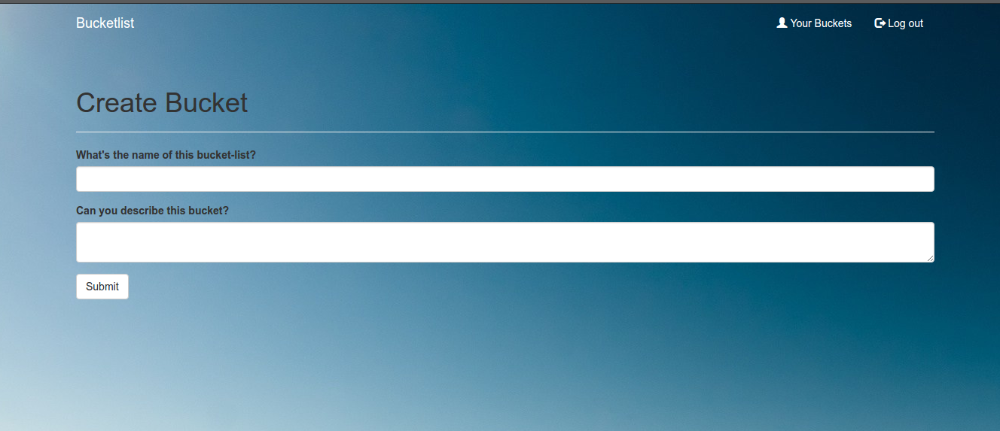

  
# BUCKETLIST
This is a web application that  allows users to record and share things they want to achieve or experience before reaching a certain age keeping track of their dreams and goals.  
It allows users to register an account and create a bucket list.  
Technology stack: Python(Flask, Jinja2), HTML/CSS/Bootstrap  

## Installation  
1. Clone the github repository from the terminal with   
`git clone git@github.com:arnawldo/bucketlist.git`  
2. Create a virtual environment  
`run virtualenv --python=python3.5 venv`
3. Install package requirements with    
`pip install -r requirements.txt`
`pip install -r test_requirements.txt`  
4. Run the application with  
`python app.py`  
5. Run tests with  
`python setup.py test`
  
   

  

  

  

